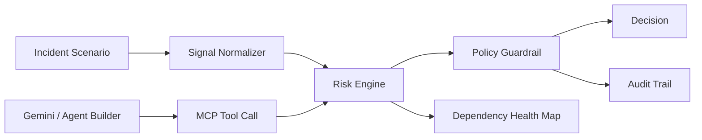

# CircuitSage Architecture

## One-Screen Flow

## Runtime Components

- `index.html`: static demo shell for judges and video recording.
- `app.js`: browser controller, canvas dependency map, scenario controls.
- `src/resilience-engine.js`: reusable decision engine.
- `mcp/circuitsage-mcp.js`: JSON-RPC tool server for agent integration.
- `tests/engine.test.js`: regression tests for clean path, outage path, policy block, circuit breaker behavior, and combined chaos.

## Engine Logic

CircuitSage computes a risk score from incident severity, peg drift, oracle lag, withdrawal velocity, vault utilization, and bridge delta. It then adjusts confidence based on dependency health.

The engine separates high-risk automation from safe human escalation:

- healthy data plus acceptable confidence allows guarded automation
- stale or missing data lowers confidence and switches to degraded mode
- corrupted policy data blocks autonomous execution
- repeated dependency failure opens a circuit breaker and routes to fallback behavior

## Rapid Agent Rubric Mapping

- Innovation & Creativity: real-time DeFi incident agent with explicit safety logic.
- Technical Implementation: shared engine, deterministic tests, stateful circuit breakers, MCP-style tool server, canvas visualization.
- Impact & Practicality: saves protocol risk teams time during incidents and reduces unsafe automation.
- UX & Design: one-screen command center optimized for repeated operator use.
- Presentation & Demo: 90-second scripted workflow with failure injection.
